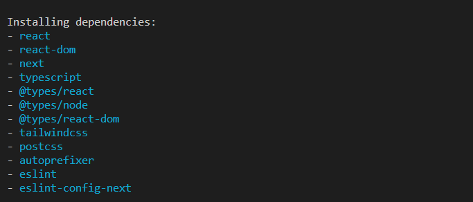

# PokeNext
Here we will find a project with Next.js

## Commands used in installation

1. npx create-next-app .

### Installed dependencies

  

####Observation: https://github.com/wilhamsJW/pokeNext/commit/ca8a5f691c49fa754d3ef41505d574be6d9f47e4

we add DNS since we are using external server